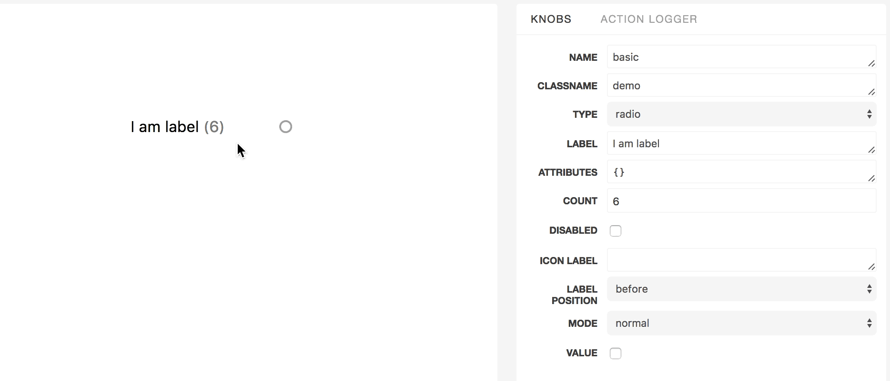
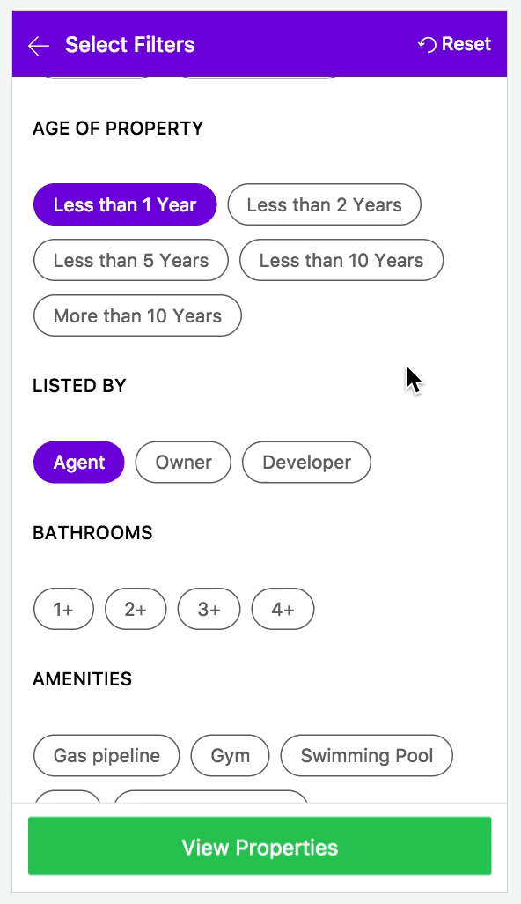

# react-controls


[](https://codecov.io/gh/filter-components/react-controls)
[](https://travis-ci.org/filter-components/react-controls)
[](https://github.com/filter-components/react-controls)
[](https://raw.githubusercontent.com/filter-components/react-controls/master/LICENSE.md)
[](https://github.com/semantic-release/semantic-release)

> A set of components like checkboxes, switches and radio buttons.

Normal Mode|Tag Mode
------|-----
| 

### Installation
```
npm install --save react-controls
```

This package consists of 2 components:
- [Toggle](#toggle)
- [Group](#group)

## &lt;Toggle/&gt;

### Basic Usage

```js
import {Toggle} from 'react-controls';

export default class X extends React.Component{
 render() {
    <Toggle
      name='story1'
      label='hello'
      disabled
      count={6}
      type='radio'
      value={true}
    />
   }
}
```

### Props

prop name | defaultValue | type
-------|------|------
attributes| {} |Sometimes you may need to add some custom attributes to the root tag of the component. attributes will accept an object where the key and values will be those attributes and their value respectively. Eg : If you pass `attributes = {'data-attr1' : 'val1','data-attr2' : 'val2'}`the root tag will have the attributes `data-attr1` and `data-attr2` with the corresponding values as `val1` and `val2` respectively
className| '' |Optional className to be added to the root tag of the component
count| null |In case you want to show aggregation/count in front of label then pass the number in this option. This is generally useful for showing the items present corresponding to that filter option.
countElem| [function](#countelem) | Return the element that you want to be rendered in place of count.
disabled| false |To disable or not to disable
iconElement| |`func`
iconLabel| ['on', 'off'] |the text to be shown in the switch button in on and off states.
label| '' |The text label for that component
mode| 'normal' |There are two modes here, 'normal' and 'tag'. 'tag' mode can be use for mobile devices where you need experience like [this](tag.gif).
name|''|name of the component
onChange| ({name, value}) | function triggered when the component is clicked
type| 'switch' |The component can be change to have the behaviour of 'switch', 'radio' or 'checkbox'.
value| false ️|[Required] `true` or `false`


#### `countElem`
type: `union(func|element)`

defaultValue:
```js
function(props) {
  return <span className='toggle-count'>({props.count})</span>;
}
```


#### `iconElement`
type: `func`

defaultValue:
```js
function(props) {
    return <i></i>
}
```

## &lt;Group/&gt;

### Basic Usage

```js
import {Group} from 'react-controls';

 const value = [{
   id: 1,
   label: 'a',
   count: 6
 }, {
   id: 2,
   label: 'b'
 }, {
   id: 3,
   label: 'c'
 }]

export default class X extends React.Component{
 render() {
     return(
        <Group
          name='group'
          type='switch'
          value={value}
        />
        )
       }
}
```

### Props

prop name | defaultValue | type
-------|------|------
attributes| {} |Sometimes you may need to add some custom attributes to the root tag of the component. attributes will accept an object where the key and values will be those attributes and their value respectively. Eg : If you pass `attributes = {'data-attr1' : 'val1','data-attr2' : 'val2'}`the root tag will have the attributes `data-attr1` and `data-attr2` with the corresponding values as `val1` and `val2` respectively
className| '' |Optional className to be added to the root tag of the component
mode| 'normal' |There are two modes here, 'normal' and 'tag'. 'tag' mode can be use for mobile devices where you need experience like [this]().
onChange| ({name, value}) | function triggered when the component is clicked.
type| 'switch' |The component can be change to have the behaviour of 'switch', 'radio' or 'checkbox'.
value| {} ️|[Required] An array of the form `[{id: 1,label: 'x', value: true, count: 4}, {id:2, label: 'y', value: true, count:7}]` .
selectedIds| `[]` or `null`| An array of selected ids for checkbox or switch and a single id for 'radio' type.
id| 'id' | The key name of the primary key.
disabled| `false` | Set to true to disable the whole group.

## Development
1. Clone the repo
1. Create a new branch.
1. Run `npm install && npm run storybook`
1. You can find the server running at **localhost:9002**
1. Add feature or fix bug. Add tests if required.
1. if commit fails make sure that there's no linting error or failed test by running `npm run test && npm run lint`


## License
MIT @ Ritesh Kumar
